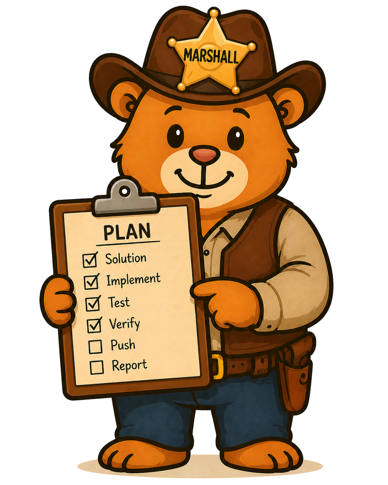

# plan-marshall-mcp



## Status

[](https://github.com/cuioss/plan-marshall-mcp/actions/workflows/maven.yml)
[](LICENSE.md)
[](https://central.sonatype.com/artifact/de.cuioss/plan-marshall-mcp)

[](https://sonarcloud.io/summary/new_code?id=cuioss_plan-marshall-mcp)
[](https://sonarcloud.io/summary/new_code?id=cuioss_plan-marshall-mcp)
[](https://sonarcloud.io/summary/new_code?id=cuioss_plan-marshall-mcp)

[Generated Documentation on github-pages](https://cuioss.github.io/plan-marshall-mcp/about.html)

## What is it?

**plan-marshall-mcp** (PM-MCP) is a local MCP server that takes over the process logic
[plan-marshall](https://github.com/cuioss/plan-marshall) implements today as a corpus of filesystem
skills plus locally executed Python scripts. The client asks the server for the state of a plan;
the answer is a representation of that state together with the valid next transitions as links
(hypermedia-driven workflow). The model follows links and contributes judgment only; the server
owns the state machine.

The design is described in the [concept documents](doc/concept/README.adoc).

> [!NOTE]
> The project is at its very beginning: the build currently produces a Quarkus application with a
> single `hello` MCP tool, packaged as a JVM container image and verified by container-based
> integration tests.

## Modules

| Module | Content |
|---|---|
| `plan-marshall-mcp` | The Quarkus application: MCP server (Quarkiverse Quarkus MCP Server, Streamable HTTP at `/mcp`), health checks on the management port (`9000`, `/q/health`), container image (`src/main/docker/Dockerfile.jvm`). |
| `integration-tests` | Builds the image, starts it with Docker Compose and runs the `*IT` tests against the running container. Never published. |

## Technology

Java 25, Quarkus (via `de.cuioss:cui-quarkus-parent`),
[Quarkus MCP Server](https://github.com/quarkiverse/quarkus-mcp-server),
[cui-http](https://github.com/cuioss/cui-http) and [TokenSheriff](https://github.com/cuioss/TokenSheriff).
See [Technology](doc/concept/10-technology.adoc).

## Build

```bash
# Build and unit tests
./mvnw clean install

# Container-based integration tests (requires Docker)
./mvnw clean verify -Pintegration-tests -pl integration-tests -am

# Pre-commit: license headers and OpenRewrite recipes - review and commit the resulting diff
./mvnw -Ppre-commit clean verify -DskipTests
```

Run the image manually:

```bash
./mvnw package -pl plan-marshall-mcp -am -DskipTests
docker build -f plan-marshall-mcp/src/main/docker/Dockerfile.jvm -t plan-marshall-mcp:jvm plan-marshall-mcp
docker run --rm -p 8080:8080 -p 9000:9000 plan-marshall-mcp:jvm
curl http://localhost:9000/q/health
```

## Credentials

All secrets (GPG, Sonatype, Sonar, Pages, Release App) are managed at the
[cuioss organization level](https://github.com/cuioss/cuioss-organization) and passed explicitly to the
reusable workflows. No repo-level secrets need to be configured.

## License

This project is licensed under the [Functional Source License, Version 1.1, ALv2 Future License (FSL-1.1-ALv2)](LICENSE.md). For the plain-English rationale — what you can and can't do, and why — see [Why this license](doc/why-this-license.adoc).

For organizations that cannot comply with the FSL's competing-use restriction during the licensed period (e.g., proprietary or closed-source deployments that compete with the software), commercial licenses are available. [Request a commercial license](https://tally.so/r/9qalQY) through the private licensing form (no public issue is created).
