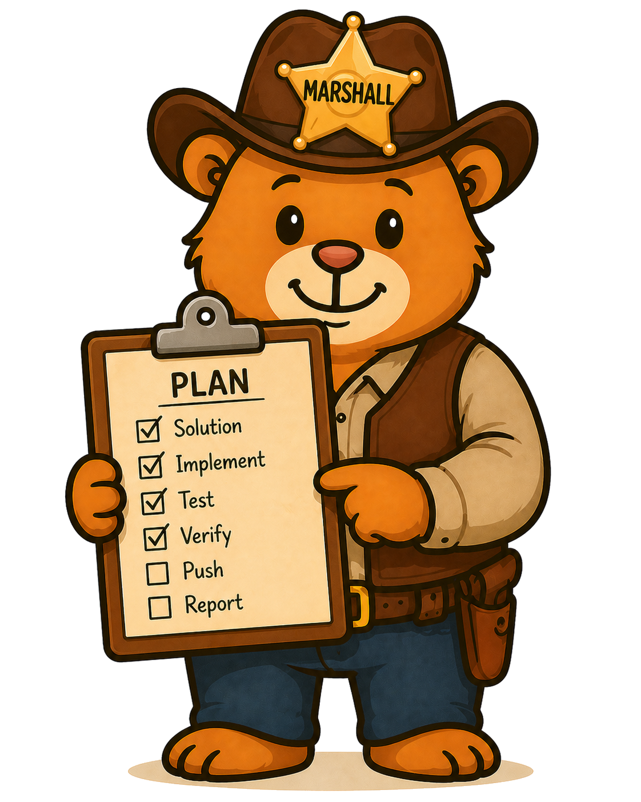

# plan-marshall-mcp



## Status

[](https://github.com/cuioss/plan-marshall-mcp/actions/workflows/maven.yml)
[](LICENSE.md)
[](https://central.sonatype.com/artifact/de.cuioss/plan-marshall-mcp)

[](https://sonarcloud.io/summary/new_code?id=cuioss_plan-marshall-mcp)
[](https://sonarcloud.io/summary/new_code?id=cuioss_plan-marshall-mcp)
[](https://sonarcloud.io/summary/new_code?id=cuioss_plan-marshall-mcp)


## What is it?

**plan-marshall-mcp** (PM-MCP) is a local MCP server that takes over the process logic
[plan-marshall](https://github.com/cuioss/plan-marshall) implements today as a corpus of filesystem
skills plus locally executed Python scripts. The client asks the server for the state of a plan;
the answer is a representation of that state together with the valid next transitions as links
(hypermedia-driven workflow). The model follows links and contributes judgment only; the server
owns the state machine.

The normative requirements are defined in [Requirements](doc/Requirements.adoc), the technical
implementation blueprints in [Specification](doc/Specification.adoc), and the delivery order in the
[Roadmap](doc/roadmap.adoc).

> [!NOTE]
> The project is at its very beginning: the build currently produces a Quarkus application with a
> single `hello` MCP tool, verified by unit tests and by integration tests against the packaged
> application.

## Modules

| Module | Content |
|---|---|
| `plan-marshall-mcp` | The Quarkus application: MCP server (Quarkiverse Quarkus MCP Server, Streamable HTTP at `/mcp`), health checks on the management port (`9000`, `/q/health`). Its `*IT` tests run against the packaged application (`@QuarkusIntegrationTest`). |

## Technology

Java 25, Quarkus (via `de.cuioss:cui-quarkus-parent`),
[Quarkus MCP Server](https://github.com/quarkiverse/quarkus-mcp-server),
[cui-http](https://github.com/cuioss/cui-http) and [TokenSheriff](https://github.com/cuioss/TokenSheriff).
See [Technology Requirements](doc/requirements/09-technology.adoc).

## Build

```bash
# Build and unit tests
./mvnw clean install

# Integration tests against the packaged application
./mvnw clean verify -Pintegration-tests -pl plan-marshall-mcp -am

# Pre-commit: license headers and OpenRewrite recipes - review and commit the resulting diff
./mvnw -Ppre-commit clean verify -DskipTests
```

Run the application manually:

```bash
./mvnw package -pl plan-marshall-mcp -am -DskipTests
java -jar plan-marshall-mcp/target/quarkus-app/quarkus-run.jar
curl http://localhost:9000/q/health
```

## Credentials

All secrets (GPG, Sonatype, Sonar, Pages, Release App) are managed at the
[cuioss organization level](https://github.com/cuioss/cuioss-organization) and passed explicitly to the
reusable workflows. No repo-level secrets need to be configured.

## License

plan-marshall-mcp is proprietary software; all rights reserved. Viewing this repository grants no right to use,
copy, modify or distribute the code. Versions up to the tag `fsl-final` (among them release 0.1.0) were published
under FSL-1.1-ALv2. See [LICENSE.md](LICENSE.md).

This repository does not accept external contributions ([CONTRIBUTING.md](CONTRIBUTING.md)).
