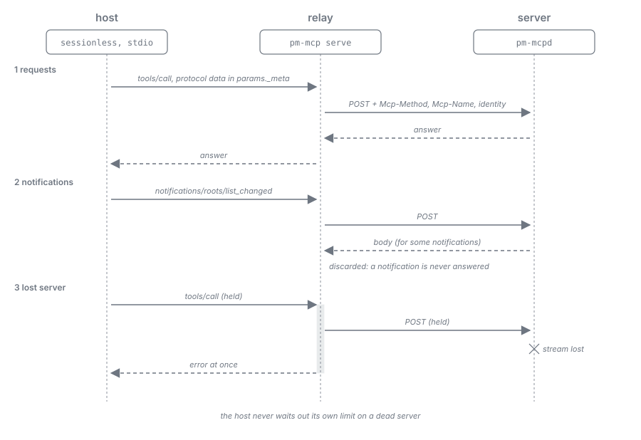

= Harness as Worker: Findings
:toc: left
:toclevels: 2
:nofooter:

xref:README.adoc[Overview] · xref:analysis.adoc[Analysis] · xref:journey.adoc[Journey] · xref:measurements.adoc[Measurements] · xref:record.adoc[Run Record] · *Findings* · xref:conclusion.adoc[Conclusion] · xref:architecture.adoc[Architecture] · xref:task-protocol.adoc[Task Protocol] · xref:roles.adoc[Roles] · xref:evaluation.adoc[Evaluation]

What building and running the verifications of Milestone 0, Part A taught beyond the measured figures: about names and instructions, about isolating a worker, about setting up the server, and about connecting hosts to it. Most of these were found because a run went wrong; each one names what the product has to do about it. Dates are 2026-10-01 to 2026-10-03.

== Names, prompts, and what the model infers

[cols="3,3", options="header"]
|===
|Finding |Consequence for the product

|*A name is read as an instruction.* The stub's MCP server was called `pullstub`. A model that only ever received "wait again" concluded "the pullstub server appears to be a stub that never yields work" and stopped.
|Hosts configure the server under the product's name `plan-marshall`; nothing a model sees (server, tool, or field names) may suggest a test, a stub, or an empty queue.

|*A worker left waiting draws its own conclusion.* Under the neutral name too, the OpenCode model stopped after 102 empty cycles: "the server has no queued tasks, so there is nothing to decide". Interactive Claude Code paused itself "to preserve token budget" although the prompt said "never stop".
|Instructions in the prompt do not keep a model pulling. The server ends idle workers before they decide to stop (xref:task-protocol.adoc#supervision[Task Protocol, Supervision]).

|*The next step must be in every answer.* Each answer of the stub named the next call (`"next": "call pull_wait"`). After `/clear` in Claude Code and after a new session in OpenCode, the model found the wait call again from that field alone, without the original instruction (but kept it up for only a few calls).
|Every representation carries its links, including the answer to a wait and to a submit; the hypermedia design already demands this.

|*The model must never carry identity.* After a compaction the interactive model passed an invented worker id taken from a value it had remembered in another session.
|Identity and generation travel in the relay's environment; the server ignores any identity the model supplies.

|*Allowlists must name tools exactly.* An OpenCode agent whose tool set named `plan-marshall_*` (a wildcard) called a tool the server registered later; with explicit names it could not (V9).
|Every role's tool set lists tool names, never patterns.
|===

[#isolation]
== Instructions and isolation

[cols="3,3", options="header"]
|===
|Finding |Consequence for the product

|*A harness inside a repository loads that repository.* Workers started in a directory inside this repository received its `CLAUDE.md` in their context; the interactive model knew it was part of a "pull-spike verification".
|A worker's working directory lies outside the project tree, or the harness's project instructions are switched off. The decided rule that jobs run "in the directory of the concrete project" so that project skills load (Z7, C3) has to be revisited: what a job needs from the project it gets through its task, not through the harness's instruction files.

|*Persistent memory crosses sessions.* A headless Claude Code session told to remember a nonce saved it to the persistent memory of the project. The value appeared in later, unrelated sessions of other runs and in the operator's own project memory, from which it had to be removed.
|A worker runs with the harness's persistent memory switched off, or in a directory whose memory is its own and is discarded with the job. "Fresh" is otherwise not fresh, and a worker can write into the operator's memory.

|*Deferred tools lose fresh jobs.* With Claude Code's tool search active, the MCP tools were not callable directly; 6 of 72 fresh Haiku jobs wrote that they had "no direct mechanism to invoke the tool" and ended without a decision.
|Claude Code workers run with `ENABLE_TOOL_SEARCH=false`. The tool definitions then take about 11k tokens of context from the start (43k instead of 32k).

|*A host started from another host inherits its markers.* The verifications were driven from a Claude Code session; its environment (`CLAUDECODE`, `CLAUDE_CODE_SESSION_ID`, and similar) would have reached every harness started from it.
|The job launcher starts harnesses with a cleaned environment that keeps the login and drops the calling host's session markers (the host-detection table names them).

|*A model without its server roams.* When the Antigravity worker could not reach its MCP server, it began to investigate with shell commands (`strings $(which agy)`), which the permission bypass needed for MCP calls in print mode allowed.
|Antigravity workers run with `--sandbox`; in general a worker's tool set is limited by the harness's own allowlist and the confinement, not by the prompt.
|===

== Setting up the server

[cols="3,3", options="header"]
|===
|Finding |Consequence for the product

|*The server does not notice a client that drops a held call.* The Quarkus MCP server held an abandoned call to its end and wrote its progress frames without an error; the step the call had taken was consumed.
|Liveness of a worker never rests on the transport; leases, the bounded wait, the process, and the acknowledgement bound it. A wait must not consume a task before the task is offered.

|*Two server timeouts end long calls.* `quarkus.http.idle-timeout` and `quarkus.mcp.server.connection-idle-timeout` both default to 30 minutes.
|The daemon sets both above the longest wait a profile allows.

|*HTTP headers do not reach a tool handler.* Neither the current request nor a value put into the request's context in a route filter was visible inside a tool handler of the Quarkus MCP server.
|Per-request metadata reaches the server as MCP data (arguments or `_meta`) or through the relay's identity on the connection, not as custom HTTP headers read in a handler.

|*Tools can be registered at runtime.* The server registered a tool in mid-run and announced it with `tools/list_changed`; hosts with an explicit allowlist did not expose it.
|Runtime registration is available if needed; the allowlist, not the server's tool list, bounds a worker.
|===

[#connecting]
== Connecting hosts

[cols="3,3", options="header"]
|===
|Finding |Consequence for the product

|*Hosts differ in session use, and one by transport.* Claude Code and Antigravity call without a session (protocol `2026-07-28`, first `server/discover`, then every request on its own); Claude Code falls back to `initialize` when discovery fails. OpenCode opens a session (protocol `2025-11-25`).
|The server supports both; the relay works for both.

|*A sessionless host does not send what the HTTP transport demands.* It puts protocol version, client info, and capabilities into `params._meta` of every request; the server's transport also wants the headers `Mcp-Method` and, for a call by name, `Mcp-Name`, and refuses the request without them.
|`pm-mcp serve` derives these headers from each message.

|*A relay must never answer a notification.* The server's transport returns a body for some notifications of a sessionless host (for example `notifications/roots/list_changed`). Written to `stdout`, it made Antigravity end the server ("failed to load: invalid request"); an earlier statement that a timeout is destructive on Antigravity was this defect.
|`pm-mcp serve` discards whatever the transport returns for a notification.

|*A relay must report a lost server.* When the stub ended during a held call, the relay at first wrote nothing; Claude Code waited out its full idle limit of 30 minutes before it noticed.
|`pm-mcp serve` answers every pending request with an error as soon as the daemon's stream is lost.

|*Client names are not what the profiles assume.* Antigravity reports `antigravity-client`, not the provisional `antigravity` of the Host Integration Table; Claude Code reports `claude-code`, OpenCode `opencode`.
|The Host Integration Table is corrected with the verified values (Part B item on provisional values).

|*Every host configures MCP differently.* Claude Code takes a per-call configuration (`--mcp-config` with `--strict-mcp-config`); OpenCode takes an inline configuration (`OPENCODE_CONFIG_CONTENT`); Antigravity has only a global entry (`agy mcp add`), which writes the user's configuration and needed the operator's consent.
|Antigravity workers share one entry; per-job identity must come from the environment (xref:evaluation.adoc#e6[E6]).

|*Tools have different names per host.* Claude Code: `mcp__<server>__<tool>`; OpenCode: `<server>_<tool>`; Antigravity: through its built-in `call_mcp_tool` with server and tool name. The headless Antigravity model found that by itself; the interactive one called the bare tool name and failed until the prompt named the convention.
|Prompts and skills refer to tools by their function, not by a host's spelling; the client profile supplies the spelling where it must appear.
|===

== Harness behaviour worth knowing

* *Interactive Claude Code moves a long call to the background* after about two minutes and ends the model's turn; it wakes the model when the call returns or fails. It also offers the model a way to schedule its own wake-up, which the model used to pause for 10 to 30 minutes.
* *Input to an interactive session is queued while the model loops*; the operator has to force it through.
* *Claude Code writes its prompt cache with a lifetime of one hour*; a cold-cache measurement needs an hour between jobs and no other run on the same model.
* *Per-turn output tokens of Claude Code* are final only in the `message_delta` events that `--include-partial-messages` adds.
* *Harness versions move during a measurement series*: Antigravity updated itself from 1.2.6 to 1.2.14 within a day, OpenCode from 1.18.32 to 1.18.34. Every result records the version.

== Measuring practice

* *Pass criteria before the run, failures recorded.* A run that failed for a tooling reason was repeated and noted; a run that failed its criterion was recorded and not repeated until it passed. Two of the most important results (the isolation leak and the OpenCode give-up) came from re-running after a setup flaw was found.
* *Machine load moves the figures.* With 19 runs started together, fresh jobs took twice as long and the start tripled. Timing cells run alone.
* *Count from the server, not from the model.* Every figure came from the stub's event log and the arrival time of the harness's output lines. The models' own accounts were wrong more than once (an interactive model described a call that had sent progress for 57 minutes as "silent for 1810 s").
* *Expensive runs need an estimate first.* One Sonnet session cost far more than expected because the scenario deliberately grows the context (xref:measurements.adoc[Measurements], V3); every run on a larger model is announced with its expected cost.
