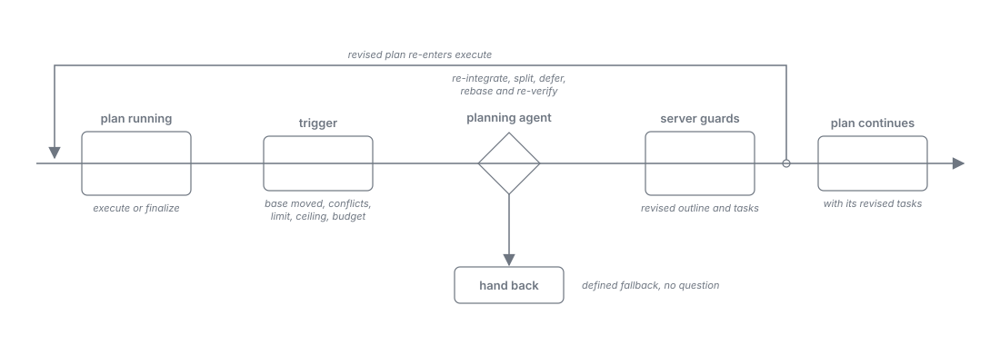

= Harness as Worker: Roles
:toc: left
:toclevels: 2
:nofooter:

xref:../../Concepts.adoc[Concepts] » xref:README.adoc[Harness as Worker] » Roles

xref:README.adoc[Overview] · xref:journey.adoc[Journey] · xref:architecture.adoc[Architecture] · xref:task-protocol.adoc[Task Protocol] · *Roles* · xref:skills.adoc[Skills]

Every model process is a worker of a role. A role fixes the worker's type (class and tool set), whether it is kept warm or started fresh, and its configuration (harness, model, effort). All workers follow the xref:task-protocol.adoc[Task Protocol].

image::../../resources/harness-as-worker-roles.svg[Warm workers, fresh workers, and the configuration that types every role, with an example assignment of harnesses, align=center]

[#target-picture]
== Warm and fresh workers

A *fresh* worker is started for one task and ends after its submit. It never waits idle, which is where workers tend to give up, and it carries nothing from one task to the next. Fresh is the default.

A *warm* worker is kept while there is work, supervised, and recycled when idle or when its token budget is reached. It saves the start for roles with frequent small decisions and pays for its context on every turn. Warm and fresh decide alike on closed decisions; a warm worker can drift on open ones, so a role runs warm only where its qualification shows it within the allowed gap to fresh.

A typical picture of a project:

* *Warm*: a planning agent for the dynamic re-planning of running plans (<<re-planning>>); a project triage role for decision points and build or CI results that cannot be mapped directly; a code triage role for review comments and static-analysis findings.
* *Fresh*: outline and planning; coding, as the execution context of a task (a writer, one per plan, in confinement); the reviews: security, simplify, and the pre-submission self-review split in two (does the code implement the requirement correctly and completely; is the code itself correct and compliant); the screener of untrusted text (<<untrusted-content>>).

Which roles exist and how each runs is configuration, not code (<<configuration>>). The picture above is one set; another project may run every role fresh.

[#re-planning]
== Dynamic re-planning

A plan is laid out once, in outline and planning, against the state of the project at that moment. A long-running plan can outlive that state. Then the plan has to be reconsidered as a whole, not repaired step by step.

=== An example

A plan with a dozen deliverables is in finalize when the base branch advances under it, among the new commits a change to the same flows the plan implements. A trial merge conflicts in a few dozen files, and the plan's review loop has already spent its ceiling. Repairing step by step does not help: rebasing alone would leave the new flows outside the plan's own requirements, and the merged change will then exceed the file limit of a required reviewer. What the situation needs is a revised plan: merge the base, bring the new flows under the plan's requirements, re-verify, and deliver the change as two pull requests.

=== How it works

* *Triggers the server detects on its own*, at fixed checkpoints with compiled thresholds: the base branch advanced with changes that overlap the plan's footprint; a trial merge conflicts; a downstream limit will be exceeded (pull-request size, a reviewer's file limit); a remediation loop spent its ceiling or a review does not converge; the plan's spend passed its budget anchor while work remains; a deliverable is infeasible. A situation is judged once; the same evidence never raises it again.
* *One mechanism.* The infeasible deliverable and the spent remediation loop are triggers of the same re-planning, not mechanisms of their own; the pre-merge spend check stays a gate on the finished plan.
* *A planning agent that reconsiders the concrete plan.* On a trigger the server offers the planning role a re-planning task with the plan's outline, tasks, done deliverables, footprint, and the trigger's facts with their evidence. The agent chooses among actions the server offers as links: re-integrate in this plan, split the change into a second pull request, defer the affected part to a follow-up plan, wait for a named prerequisite to land, rebase and re-verify only, or hand back. A revised outline and new tasks pass the same server guards as a first plan, and the plan continues on a new version of its instance.
* *Bounded.* A plan has a small re-planning budget; a re-entry renews the remediation budgets once, so every loop of the plan stays bounded. A follow-up of a plan in an epic becomes a row of the epic, which starts it.
* *No operator mid-plan.* The re-planning task asks no one. When the budget is spent, the task is lost, or no configuration of the planning role qualifies yet, the server takes the trigger's conservative fallback: the remediation path the plan would have taken anyway, or the hand-back.

[#untrusted-content]
== Untrusted content

Untrusted text (review comments, static-analysis messages, web content, issue bodies) never reaches a worker unchecked. The server first cleans it deterministically (level 1: among others, collapsed sections and the disclosure footers of review bots, which address agents legitimately), then a screener checks it for instructions aimed at a model (level 2).

The screener is a fresh job with a server-fixed prompt, no tools, an isolated directory, and one turn, failing closed. A warm screener would save the start but keeps tools, and injected text can act on the task that carries it; a fresh job has nothing to misuse and carries nothing to the next batch.

[#configuration]
== Roles are configuration

No role is fixed in the code. A role is one configuration artifact, and the roles that exist are exactly the artifacts present; a workflow names a role by its name, and any name the configuration defines can be used.

* *The artifact defines everything about the role*: its description, its class (reader, writer, zero-tool) and its tool set of exact tool names, the harness, model, and effort it runs on, its form (warm or fresh), how many workers or jobs run at once, its skills (the role skill is its contract, xref:skills.adoc[Skills]), and its recycling rules.
* *One abstract caller*: the server has a single model caller. It reads the artifact of the role a workflow state names and acts on it. Nothing else in the server knows what a role is for.
* *Sets of artifacts*: the artifacts form a set per project or machine, with precedence of project over machine over the shipped defaults. Changing a role, adding one, or moving it to another harness is an edit of the set. A workflow that names a role the set does not define is refused when it is composed.
* *Example assignment*: OpenCode for planning and the main thread, Claude Code for coding and reviews.
* *Host suitability constrains the sets, not the code*: the client profile says whether a harness is eligible as a worker host, and which of its models accept a restricted tool set.
* *Qualification*: a role runs only on a configuration that answered the role's questions of the model verification corpus at the operator's level. Until one qualifies, the role's tasks take a conservative server fallback, never a question to the operator.

== A worker asks another role

A worker that needs another model's judgment, for example project triage asking a review role, asks through the server where its workflow state offers that consultation (xref:task-protocol.adoc#consultation[Task Protocol, Consultation]). The consultation is a workflow step, so it stays deterministic and within the single-level leaf constraint.
