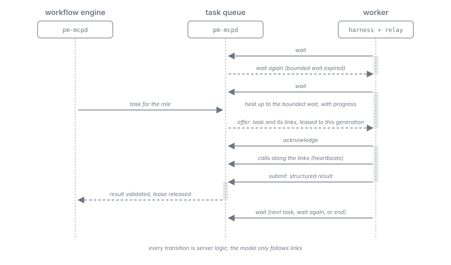
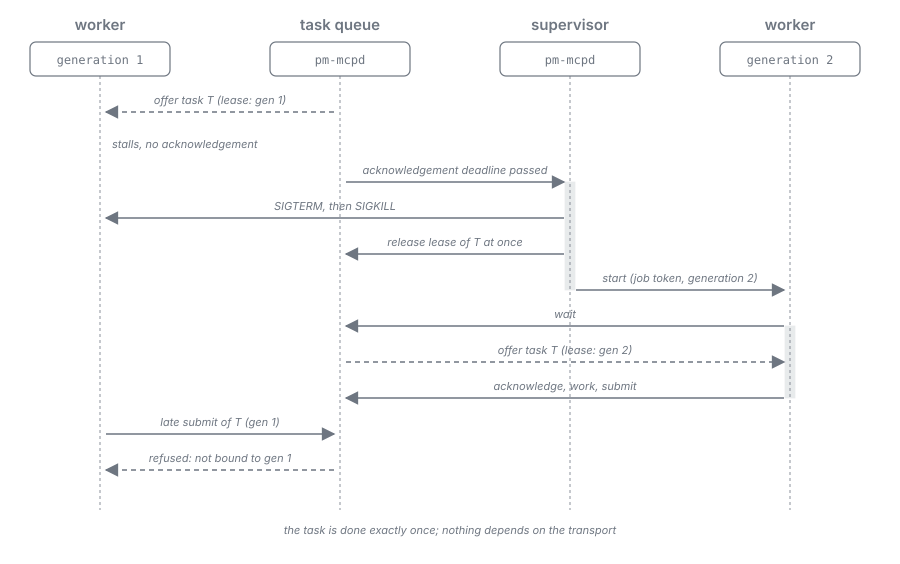

= Harness as Worker: Task Protocol
:toc: left
:toclevels: 2
:nofooter:

xref:../../Concepts.adoc[Concepts] » xref:README.adoc[Harness as Worker] » Task Protocol

xref:README.adoc[Overview] · xref:journey.adoc[Journey] · xref:architecture.adoc[Architecture] · *Task Protocol* · xref:roles.adoc[Roles] · xref:skills.adoc[Skills]

The exchange between the server and a worker. Every worker follows it, whether the server started it or it is the interactive session that started the plan. The protocol is a reusable sub-workflow of the workflow DSL: every transition is server logic, and the model only follows the links it is offered. The states, parameters, and rules are specified in link:../../specification/dispatch-and-effort.adoc[Model Jobs & Effort]; the values per host in link:../../specification/client-profiles.adoc[Client Profiles].

== Steps

. *Wait*: the worker holds a wait call open, bounded below the host's limit; where the host needs it, the server sends progress frames during the wait.
. *Offer*: the server answers the wait with a task. MCP gives the server no way to make a harness act, so an offer is always the answer to a pending call. The task is leased to the worker's current generation and carries the skills it requires that this generation has not received yet.
. *Acknowledge*: the worker confirms the task. The acknowledgement tells the server that the worker is alive and has the task.
. *Execute*: the worker does the task by following the links of the task's representation. During long work its calls serve as heartbeats.
. *Submit*: the worker submits a structured result through the offered link. The server checks it against the link's schema, the lease, and the generation.
. *Wait or end*: the server answers the next wait with the next task, with "wait again", or with "end".

== States

image::../../resources/harness-as-worker-task-states.svg[Worker states: waiting, offered, acknowledged, executing, consulting, submitted, lost, and ended, with their transitions, align=center]

A worker is _waiting_ while it holds a wait call, _offered_ once a task is leased to it, _acknowledged_ and then _executing_ while it works along the task's links, and _consulting_ while it waits for another role's answer. A submit leads back to waiting or to the end. A worker the server gives up on is _lost_: its lease is released at once and its task returns to the queue for a successor.

[#supervision]
== Supervision

Neither the transport nor the model reports that a worker is lost or about to give up. The server therefore watches each worker itself and ends it on any of these signals:

* *Process exit*: the harness process ends without the server's instruction.
* *Silence*: no open wait call and no other call for longer than the bounded wait plus a grace.
* *Missing acknowledgement*: no acknowledgement within the host's deadline after an offer.
* *Idle period*: a few wake-ups without a task; a long-idle worker tends to give up, and every wake-up costs.
* *Token budget*: the context, read from the per-turn usage, approaches the role's budget; a warm loop breaks as its context grows.

Ending a worker is `SIGTERM`, then `SIGKILL`, then the fence. A worker that exits before its first call has not been lost but failed to start; after a few such starts the server stops replacing it and tells the operator.

== Fencing and leases

* Every worker has a generation, issued with its job token and carried by the relay.
* A task is leased to one generation; a call or submit of another generation for that task is refused.
* When the server replaces a worker, it releases the lease at once and offers the task to the successor exactly once.
* The successor starts with an empty context. Nothing is handed over, because every task carries what its state needs.

[#consultation]
== Consultation

A worker that needs another model's judgment asks through the server, never directly, and only where the workflow provides for it: a state declares the consultations it offers by role name (for example `consult role triage`), and the server looks up that role's configuration like any other.

. While executing, the worker follows one of the consultation links its state offers and submits the question.
. The server creates a task for the named role and runs it like any other task.
. The asker waits within its bounded wait, with progress frames where the host needs them.
. The answer arrives as the answer to the asker's next wait; the asker continues and refers to the consultation in its final submit.

image::../../resources/harness-as-worker-consultation.svg[A worker asks another role through the server and receives the answer through its pending wait, align=center]

The flow is deterministic and stays within the single-level leaf constraint: a worker never starts another model itself.

== The interactive session as a worker

The session that started a plan may take a task when it is attentive, beside a headless worker that takes the task when the session does not acknowledge in time. The plan never waits on the session. Each start of a session gives it a new generation, which fences an earlier loop of the same session that may still be running.
